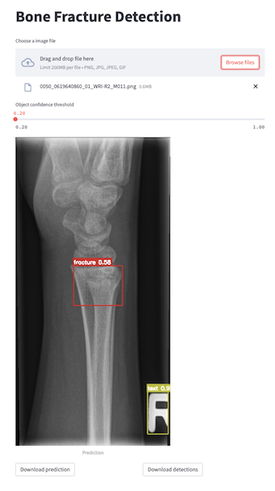

# YOLOv7 for Bone Fractures Detection

Trained YOLOv7 for bone fracture detections.

 
## Data
The [GRAZPEDWRI-DX](https://www.nature.com/articles/s41597-022-01328-z) is a open dataset containing 20327 annotated pediatric trauma wrist radiograph images of 6091 patients, treated at the Department for Pediatric Surgery of the University Hospital Graz between 2008 and 2018. Several pediatric radiologists annotated the images by placing bounding boxes to mark 9 different classes:

- `boneanomaly`  (276 boxes),
- `bonelesion` (45 boxes),
- `foreignbody` (8 boxes),
- `fracture` (18090 boxes),
- `metal` (818 boxes),
- `periostealreaction` (3453 boxes),
- `pronatorsign` (567 boxes),
- `softtissue` (464 boxes),
- `text` (23722 boxes).

*Fig1: few random testing images visualization within their realive ground-truth and the predicted labels with their confidence score by the trained YOLOv7-p6 model.*

The data are already annotate in many different formats, one of the is the YOLO one. Indeed, [YOLOv7](https://github.com/WongKinYiu/yolov7.git) is the chosen model for this project.

## Prepare folder

First download the YOLOv7 repo:

    git clone https://github.com/WongKinYiu/yolov7.git
    cd yolov7

Then download the GRAZPEDWRI-DX dataset and stored it in the `GRAZPEDWRI-DX_dataset` folder. Keep the YOLO annotations (`.txt` files) and extract the images from the `.zip` into the `images` folder.

## Conda environvment

    conda create -n yolov7 python=3.9
    conda activate yolov7
    pip install -r requirements.txt

## Split data

The dataset iamges and annotatation are contained into `data/full/images` and `data/full/labels` respectively. The script:

    python split.py

will divide the dataset into training, validation, and testing set (70-20-10 %) according to the key `patient_id` stored in `dataset.csv`. The script then will move the files into the relative folder as it is represented here below.

    └── GRAZPEDWRI-DX_dataset     
         ├── yolov5
         │    ├── images
         │    └── labels
         ├── images
         │    ├── train
         │    │    ├── train_img1.png
         │    │    └── ...
         │    ├── valid
         │    │    ├── valid_img1.png
         │    │    └── ...
         │    └── test
         │         ├── test_img1.png
         │         └── ...
         └── labels
              ├── train
              │    ├── train_annotation1.txt
              │    └── ...
              ├── valid
              │    ├── valid_annotation1.txt
              │    └── ...
              └── test
                   ├── test_annotation1.txt
                   └── ...

The script will create 3 files: `train_data.csv`, `valid_data.csv`, and `test_data.csv` with the same structure of `dataset.csv`.

## Download the models

You can download the models from `Releases` on the right banner. On the other hand you can also download them typing on your terminal:

    wget https://github.com/mdciri/YOLOv7-Bone-Fracture-Detection/releases/download/trained-models/yolov7-p6-bonefracture.onnx

or

    wget https://github.com/mdciri/YOLOv7-Bone-Fracture-Detection/releases/download/trained-models/yolov7-p6-bonefracture.pt

## ONNX Inference

It is available the ONNX model in `./yolov7-p6-bonefracture.onnx`, and inferece can be performed:

    python inference_onnx.py --model-path <onnx model path> --img-path <input image path> --dst-path <destination folder for predictions>

for example:

    python inference_onnx.py --model-path ./yolov7-p6-bonefracture.onnx --img-path ./GRAZPEDWRI-DX_dataset/images/test/0038_0775938745_03_WRI-L2_M014.png --dst-path ./predictions

The results (the predicted labelled image in `.png` file, and the predicted labels in `.txt` file) in the destination folder indicated. Each detection is saved as:

    <class> <confidence_score> <bbox_Xcenter> <bbox_Ycenter> <bbox_Width> <bbox_Height>

N.B.: remeber to install the requirements:

    pip install onnx onnxruntime

## App GUI

    python gui/gui.py

GUI icons were made by [Freepik](https://www.flaticon.com/authors/freepik), [smashingstocks](https://www.flaticon.com/authors/smashingstocks), [photo3idea_studio](https://www.flaticon.com/authors/photo3idea-studio), [Yogi Aprelliyanto](https://www.flaticon.com/authors/yogi-aprelliyanto), [Muhammad Ali](https://www.flaticon.com/authors/muhammad-ali), and [dmitri13](https://www.flaticon.com/authors/dmitri13) from [www.flaticon.com](www.flaticon.com).

The GUI is done using PySide6, so first install it with:

    pip install PySide6

*Fig2: Bone Fracture Detection GUI.*

## WebApp

    streamlit run app/webapp.py  

*Fig3: Bone Fracture Detection WebApp made with streamlit.*

## Docker

    docker pull mdciri/bone-fracture-detection:latest
    docker run -p 8501:8501 mdciri/bone-fracture-detection

## Train, test, detect

The torch model is also available in `./yolov7-p6-bonefracture.pt` and you can evaluate it or perform inference using `test.py` and `detect.py` script respectively of the YOLOv7 repo. On the contrary, if you want to train the model, use `train.py`.

## Results

The evaluation of the 3 different datasets is collected in the `runs/test` folder. For each dataset are saved the predicted labels by the model, the confusion matrix, the F1, P, R, and PR curve plot.

## License

GNU General Public License v3.0 as the [YOLOv7 lincense](https://github.com/WongKinYiu/yolov7/blob/main/LICENSE.md).

## References

- [A pediatric wrist trauma X-ray dataset (GRAZPEDWRI-DX) for machine learning](https://www.nature.com/articles/s41597-022-01328-z)
- [YOLOv7: Trainable bag-of-freebies sets new state-of-the-art for real-time object detectors](https://arxiv.org/abs/2207.02696)

