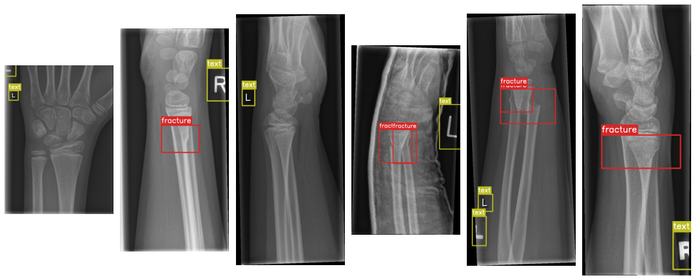
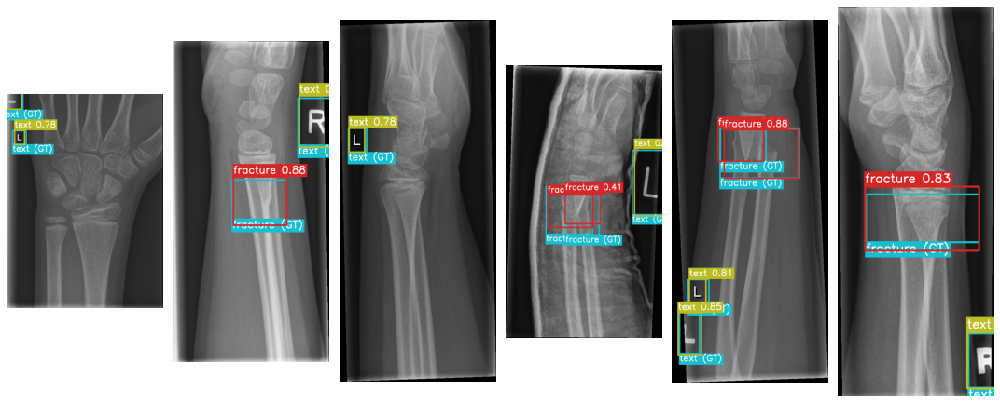

# YOLOv7 for the GRAZPEDWRI-DX dataset

The [GRAZPEDWRI-DX](https://www.nature.com/articles/s41597-022-01328-z) is a open dataset containing 20327 annotated pediatric trauma wrist radiograph images of 6091 patients, treated at the Department for Pediatric Surgery of the University Hospital Graz between 2008 and 2018. Several pediatric radiologists annotated the images by placing bounding boxes to mark 9 different classes:

- `boneanomaly`  (276 boxes),
- `bonelesion` (45 boxes),
- `foreignbody` (8 boxes),
- `fracture` (18090 boxes),
- `metal` (818 boxes),
- `periostealreaction` (3453 boxes),
- `pronatorsign` (567 boxes),
- `softtissue` (464 boxes),
- `text` (23722 boxes).

*Fig1: few random testing images visulaization within their ground-truth label and relative bounding box.*

The data are already annotate in many different formats, one of the is the YOLO one. Indeed, [YOLOv7](https://github.com/WongKinYiu/yolov7.git) is the chosen model for this project.

## Prepare folder

First download the YOLOv7 repo:

    git clone https://github.com/WongKinYiu/yolov7.git
    cd yolov7
    mkdir GRAZPEDWRI-DX_dataset

Then download the GRAZPEDWRI-DX dataset and stored it in the `GRAZPEDWRI-DX_dataset` folder. Keep the YOLO annotations (`.txt` files) and extract the images from the `.zip` into the `images` folder.

## Conda environvment

    conda create -n yolov7 python=3.9
    conda activate yolov7
    pip install -r requirements.txt

## Split data

The dataset iamges and annotatation are contained into `data/full/images` and `data/full/labels` respectively. The script:

    python split.py

will divide the dataset into training, validation, and testing set (70-20-10 %) according to the key `patient_id` stored in `dataset.csv`. The script then will move the files into the relative folder as it is represented here below.

    └── GRAZPEDWRI-DX_dataset     
         ├── yolov5
         │    ├── images
         │    └── labels
         ├── images
         │    ├── train
         │    │    ├── train_img1.png
         │    │    └── ...
         │    ├── valid
         │    │    ├── valid_img1.png
         │    │    └── ...
         │    └── test
         │         ├── test_img1.png
         │         └── ...
         └── labels
              ├── train
              │    ├── train_annotation1.txt
              │    └── ...
              ├── valid
              │    ├── valid_annotation1.txt
              │    └── ...
              └── test
                   ├── test_annotation1.txt
                   └── ...

The script will create 3 files: `train_data.csv`, `valid_data.csv`, and `test_data.csv` with the same structure of `dataset.csv`.

## Train, test, detect

Follow the instruction in the YOLOv7 repo scripts `train.py` and `test.py` to train and evaluate the model respectively. Whereas to perform inference use `detect.py`.

## Results

In `rruns/train/yolov7/weights/yolov7-p6-bonefracture.pt` are saved the weights of the YOLOv7 trained model using the `p6` hyper-parameters.

The evaluation of the 3 different datasets is collected in the `runs/test` folder. For each dataset are saved the predicted labels by the model, the confusion matrix, the F1, P, R, and PR curve plot.

## Visualization

You can use `data_overview.ipnb` to describe a dataset table (one `.csv` file) and visulize few model predictions compared to the relative ground-truths.

*Fig2: few random testing images visulaization within their realive ground-truths and the predicted label, relative bounding box, and confidence score by the YOLOv7-p6 model.*

## References

- [A pediatric wrist trauma X-ray dataset (GRAZPEDWRI-DX) for machine learning](https://www.nature.com/articles/s41597-022-01328-z)
- [YOLOv7: Trainable bag-of-freebies sets new state-of-the-art for real-time object detectors](https://arxiv.org/abs/2207.02696)

